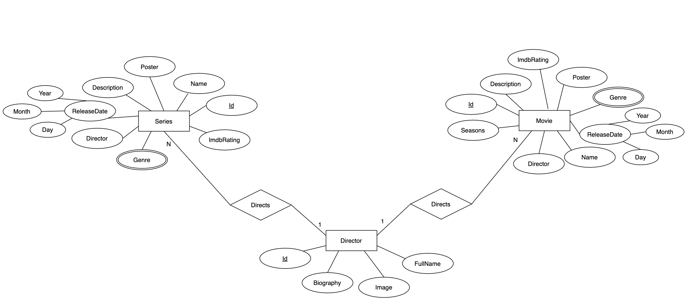
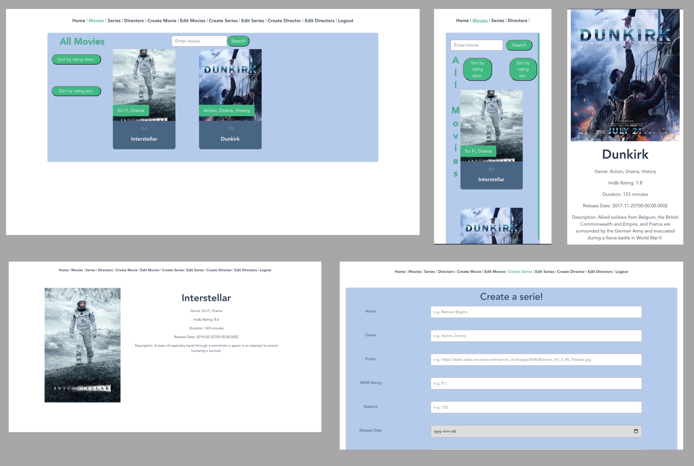

# Backend and Frontend Template

Latest version: https://git.ita.chalmers.se/courses/dit341/group-00-web (public Github [mirror](https://github.com/dit341/group-00-web))

## Project Structure

| File                                                 | Purpose                           | What you do?                              |
| ---------------------------------------------------- | --------------------------------- | ----------------------------------------- |
| `server/`                                            | Backend server code               | All your server code                      |
| [server/README.md](server/README.md)                 | Everything about the server       | **READ ME** carefully!                    |
| `client/`                                            | Frontend client code              | All your client code                      |
| [client/README.md](client/README.md)                 | Everything about the client       | **READ ME** carefully!                    |
| [docs/DEPLOYMENT.md](docs/DEPLOYMENT.md)             | Free online production deployment | Deploy your app online in production mode |
| [docs/LOCAL_DEPLOYMENT.md](docs/LOCAL_DEPLOYMENT.md) | Local production deployment       | Deploy your app local in production mode  |

## Requirements

The version numbers in brackets indicate the tested versions but feel free to use more recent versions.
You can also use alternative tools if you know how to configure them (e.g., Firefox instead of Chrome).

- [Git](https://git-scm.com/) (v2) => [installation instructions](https://www.atlassian.com/git/tutorials/install-git)
  - [Add your Git username and set your email](https://docs.gitlab.com/ce/gitlab-basics/start-using-git.html#add-your-git-username-and-set-your-email)
    - `git config --global user.name "YOUR_USERNAME"` => check `git config --global user.name`
    - `git config --global user.email "email@example.com"` => check `git config --global user.email`
  - > **Windows users**: We recommend to use the [Git Bash](https://www.atlassian.com/git/tutorials/git-bash) shell from your Git installation or the Bash shell from the [Windows Subsystem for Linux](https://docs.microsoft.com/en-us/windows/wsl/install-win10) to run all shell commands for this project.
- [Chalmers GitLab](https://git.ita.chalmers.se/) => Login with your **Chalmers CID** choosing "Sign in with" **Chalmers Login**. (contact [support@chalmers.se](mailto:support@chalmers.se) if you don't have one)
  - DIT341 course group: https://git.ita.chalmers.se/courses/dit341
  - [Setup SSH key with Gitlab](https://docs.gitlab.com/ee/ssh/)
    - Create an SSH key pair `ssh-keygen -t ed25519 -C "email@example.com"` (skip if you already have one)
    - Add your public SSH key to your Gitlab profile under https://git.ita.chalmers.se/profile/keys
    - Make sure the email you use to commit is registered under https://git.ita.chalmers.se/profile/emails
  - Checkout the [Backend-Frontend](https://git.ita.chalmers.se/courses/dit341/group-00-web) template `git clone git@git.ita.chalmers.se:courses/dit341/group-00-web.git`
- [Server Requirements](./server/README.md#Requirements)
- [Client Requirements](./client/README.md#Requirements)

## Getting started

```bash
# Clone repository
git clone git@git.ita.chalmers.se:courses/dit341/group-00-web.git

# Change into the directory
cd group-00-web

# Setup backend
cd server && npm install
npm run dev

# Setup frontend
cd client && npm install
npm run serve
```

> Check out the detailed instructions for [backend](./server/README.md) and [frontend](./client/README.md).

## Visual Studio Code (VSCode)

Open the `server` and `client` in separate VSCode workspaces or open the combined [backend-frontend.code-workspace](./backend-frontend.code-workspace). Otherwise, workspace-specific settings don't work properly.

## System Definition (MS0)

### Purpose

The website will allow the user to see list of movies and series. The website will show details about both upcoming and released movies/series. Users also will be able to see more detailed information about directors, such as a short biography, image and a list of movies/series directed by them.

### Pages

- Home: This is a homepage that welcomes the users and allows them to navigate to movies or series pages.

- Movies: This page shows a list of movies. Users can also search for a movie. Users can choose a movie from the list and click on it in order to navigate to that specific movies page.

- Movie: This page shows detailed information about the chosen movie; release date, director, genre etc. Users can click on the directors name in order to navigate to the directors page and see more detailed information about the director.

- Series: This page shows a list of series. Users can also search for a serie. Users can choose a serie from the list and click on it in order to navigate to that specific series page.

- Serie: This page shows detailed information about the chosen serie; release date, director, genre etc. Users can click on the directors name in order to navigate to the directors page and see more detailed information about the director.

- Directors: This page shows a list of directors. Users can choose a director from the list and click on it in order to navigate to that specific directors page.

- Director: This page shows detailed information about the chosen director. Users can also see a list of movies/series the director has worked on.

- Register: This page is used to create an admin account. Created account can later be used in order to make changes in the system.

- Login: Admins use this page to login to their accounts. Loging in gives the admin access to the rest of the website.

- Create Movie: There is a form in the page which is used to add a movie to the database, which will then be shown on Movies Page. (This page is not visible to a regular user, only admins can access it)

- Create Serie: There is a form in the page which is used to add a serie to the database, which will then be shown on Series Page. (This page is not visible to a regular user, only admins can access it)

- Create Director: There is a form in the page which is used to add a director to the database, which will then be shown on Directors Page. (This page is not visible to a regular user, only admins can access it)

- Create Director Movie: This page is almost identical to Create Movie page, the only difference is that in this page, the user does not need to fill in the director ID while creating a movie.(This page is not visible to a regular user, only admins can access it)

- Admin Movies: This page is identical to the regular Movies Page but it is meant for admins to use. The only difference is that when an admin click on a movie from the list, instead of being directed to Movie Page, they will be directed to Edit Movie Page for the chosen movie. Admins can also delete all movies from the system. (This page is not visible to a regular user, only admins can access it)

- Admin Series: This page is identical to the regular Series Page but it is meant for admins to use. The only difference is that when an admin click on a serie from the list, instead of being directed to Serie Page, they will be directed to Edit Serie Page for the chosen serie. Admins can also delete all series from the system. (This page is not visible to a regular user, only admins can access it)

- Admin Directors: This page is identical to the regular Directors Page but it is meant for admins to use. The only difference is that when an admin click on a director from the list, instead of being directed to Director Page, they will be directed to Edit Director Page for the chosen director. Admins can also delete all directors from the system. (This page is not visible to a regular user, only admins can access it)

- Edit Movie: There is a form in the page which is used to edit an existing movie in the system. Admins can also delete the chosen movie. (This page is not visible to a regular user, only admins can access it)

- Edit Serie: There is a form in the page which is used to edit an existing serie in the system. Admins can also delete the chosen serie. (This page is not visible to a regular user, only admins can access it)

- Edit Director: There is a form in the page which is used to edit an existing director in the system. Admins can also delete the chosen director. (This page is not visible to a regular user, only admins can access it)

### Entity-Relationship (ER) Diagram



## Teaser (MS3)


